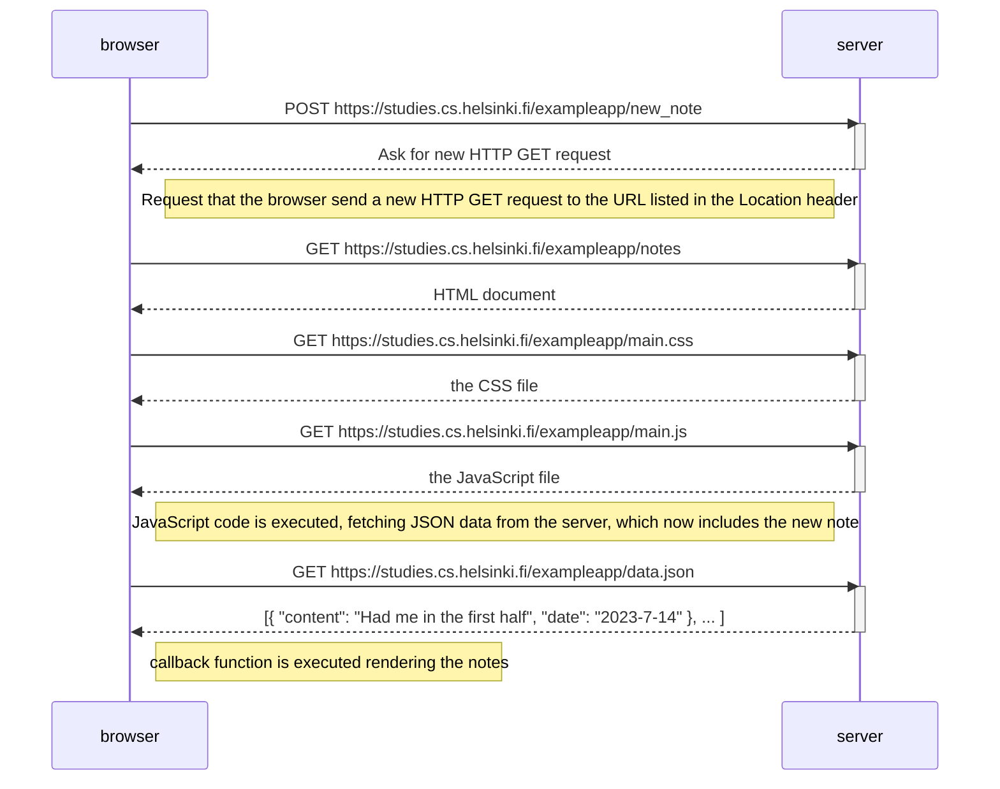

```mermaid


sequenceDiagram
    participant browser
    participant server

    browser->>server: POST https://studies.cs.helsinki.fi/exampleapp/new_note
    activate server
    server-->>browser:  Ask for new HTTP GET request
    deactivate server

    Note left of server: Request that the browser send a new HTTP GET request to the URL listed in the Location header

    browser->>server: GET https://studies.cs.helsinki.fi/exampleapp/notes
    activate server
    server-->>browser: HTML document
    deactivate server

    browser->>server: GET https://studies.cs.helsinki.fi/exampleapp/main.css
    activate server
    server-->>browser: the CSS file
    deactivate server

    browser->>server: GET https://studies.cs.helsinki.fi/exampleapp/main.js
    activate server
    server-->>browser: the JavaScript file
    deactivate server

    Note right of browser: JavaScript code is executed, fetching JSON data from the server, which now includes the new note

    browser->>server: GET https://studies.cs.helsinki.fi/exampleapp/data.json
    activate server
    server-->>browser: [{ "content": "Had me in the first half", "date": "2023-7-14" }, ... ]
    deactivate server

    Note right of browser: callback function is executed rendering the notes
```
